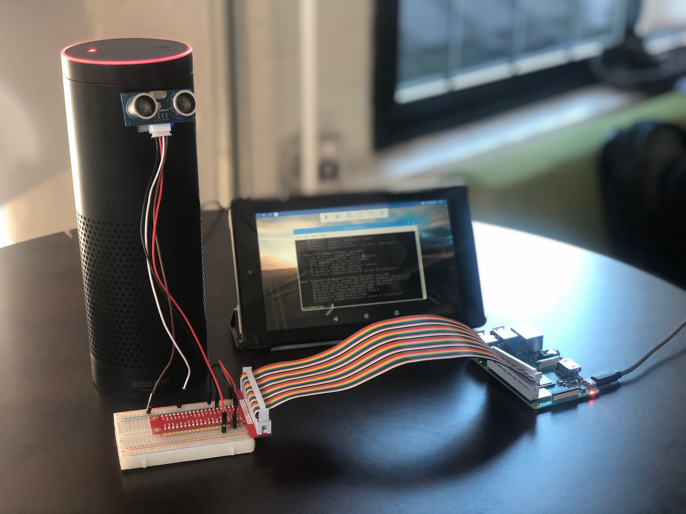
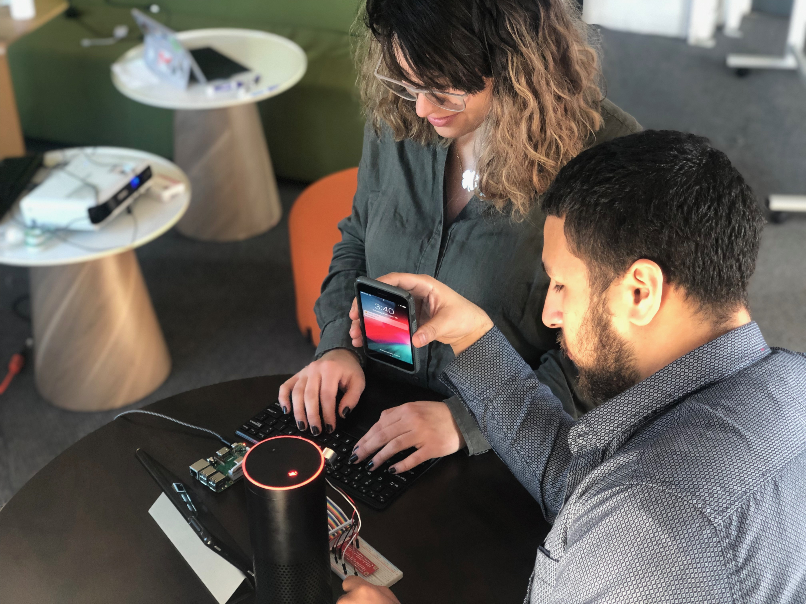
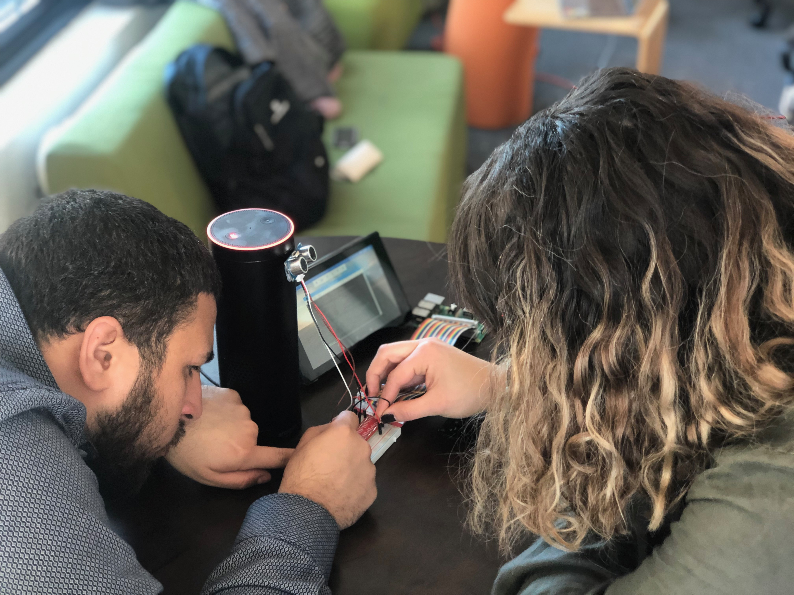

## Blind Spot
<!-- test on line #3 -->

## Live Demo
Link: https://mesuara.github.io/Blind_spot/

## Description
Blind spot is a low cost do it yourself iOT security system that utilizes a Raspberry Pi, Google, and Alexa to measure and report distance.

Current MVP version 0.1 A-🛤️  
- Raspberry Pi [Collection of Data] 🍇 🥧  
- Google Cloud [Persist Data] 🍭 ☁️  
- Alexa Skill [Query Database] 👾👾 👧🏻 👾👾  
- Website [View Data] 💻  

Want to keep up with the development of Blind Spot?  https://github.com/mesuara/Blind_spot

## Screenshots

## Endpoints:

Coming Soon!!

<!-- #### `coach`

- [x] router.get('/')
- [x] router.get('/:id')

- [x] router.post('/')

- [x] router.post('/login')

- [x] router.put('/:id') -->
